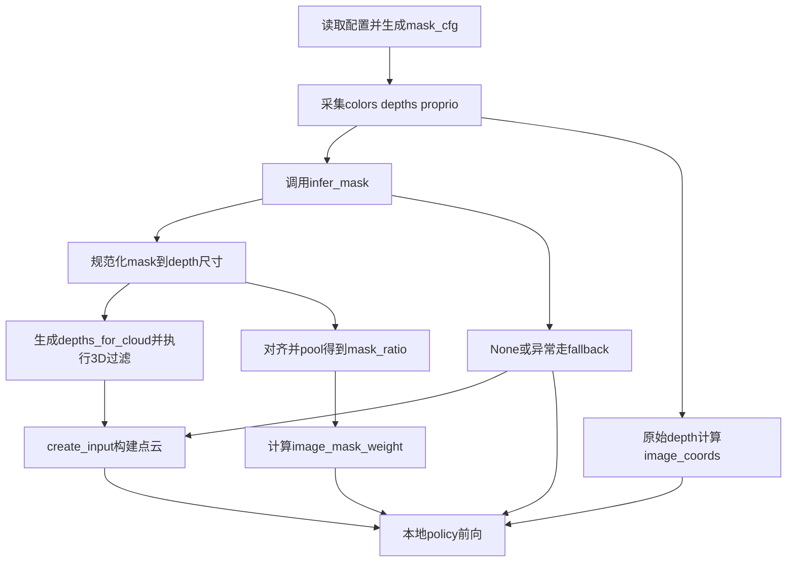

# Mask-Aware 推理阶段改造编码前可执行计划 v1

## 0. 文档定位

- 目标：为 Coding Agent 提供可直接执行的本地推理改造计划，仅覆盖 [`evaluate()`](eval.py:156) 所在链路。
- 约束来源：[`plans/mask_aware_inference_spec_local_v1.md`](plans/mask_aware_inference_spec_local_v1.md) 与 [`plans/AGENTS.md`](plans/AGENTS.md)。
- 实施文件边界：只允许改动 [`eval.py`](eval.py:1)。

---

## 1. 约束提炼

### 1.1 MUST 约束

1. 默认配置下，mask 缺失不得导致 rollout 中断，除非显式配置 fail_fast，来源 [`plans/mask_aware_inference_spec_local_v1.md`](plans/mask_aware_inference_spec_local_v1.md)。
2. mask 语义固定为 1 不可信、0 可信，阈值逻辑固定为 mask_png 大于 mask_threshold，默认 threshold 为 0，来源 [`plans/mask_aware_inference_spec_local_v1.md`](plans/mask_aware_inference_spec_local_v1.md)。
3. 3D 过滤必须发生在深度图阶段，逻辑等价于 depths_for_cloud 上对 mask 区域置零，来源 [`plans/mask_aware_inference_spec_local_v1.md`](plans/mask_aware_inference_spec_local_v1.md)。
4. 图像坐标分支必须始终使用原始深度计算 [`ImageProcessor.get_image_coordinates()`](dataset/data_utils.py:243)，不能使用过滤后深度，来源 [`plans/mask_aware_inference_spec_local_v1.md`](plans/mask_aware_inference_spec_local_v1.md)。
5. 2D 降权必须满足 image_mask_weight 等于 1 减 mask_ratio，且范围在 0 到 1，来源 [`plans/mask_aware_inference_spec_local_v1.md`](plans/mask_aware_inference_spec_local_v1.md)。
6. 2D 权重必须兼容 [`WeightedSpatialInterpolation.forward()`](policy/sparse_modules.py:72) 的 src_weights 机制，来源 [`plans/mask_aware_inference_spec_local_v1.md`](plans/mask_aware_inference_spec_local_v1.md)。
7. mask 不可用时必须可完全回退到旧路径，默认策略必须继续推理，来源 [`plans/mask_aware_inference_spec_local_v1.md`](plans/mask_aware_inference_spec_local_v1.md)。
8. 必须从推理配置读取 mask_aware，缺失键必须使用 spec 默认值，来源 [`plans/mask_aware_inference_spec_local_v1.md`](plans/mask_aware_inference_spec_local_v1.md)。
9. 当 mask_aware.enabled 为 false 时，行为必须与当前旧版本地推理一致，来源 [`plans/mask_aware_inference_spec_local_v1.md`](plans/mask_aware_inference_spec_local_v1.md)。
10. 推理期 mask 接口必须在 [`eval.py`](eval.py:1) 内定义统一签名 infer_mask color depth proprio meta，允许返回 None，来源 [`plans/mask_aware_inference_spec_local_v1.md`](plans/mask_aware_inference_spec_local_v1.md)。
11. mask 返回为非 None 时，必须规范化为 float32 的 0 或 1；若尺寸不一致，必须最近邻 resize 到 depth 尺寸，来源 [`plans/mask_aware_inference_spec_local_v1.md`](plans/mask_aware_inference_spec_local_v1.md)。
12. 不可修复的非法 mask 输出必须按 infer_none_policy 处理，来源 [`plans/mask_aware_inference_spec_local_v1.md`](plans/mask_aware_inference_spec_local_v1.md)。
13. 3D 过滤后空点云默认必须 warn_and_skip_filter 并回退到未过滤深度重建，来源 [`plans/mask_aware_inference_spec_local_v1.md`](plans/mask_aware_inference_spec_local_v1.md)。
14. 任意情况下不得产生 NaN 或 Inf，来源 [`plans/mask_aware_inference_spec_local_v1.md`](plans/mask_aware_inference_spec_local_v1.md)。
15. 必须保持本地数据流顺序并在本地前向时向 [`RISE2.forward()`](policy/policy.py:52) 传 image_mask_weight 或 None，来源 [`plans/mask_aware_inference_spec_local_v1.md`](plans/mask_aware_inference_spec_local_v1.md)。

### 1.2 SHOULD 约束

1. 对不可修复 shape 的 mask 输出打印单行告警，包含帧索引和 shape，来源 [`plans/mask_aware_inference_spec_local_v1.md`](plans/mask_aware_inference_spec_local_v1.md)。
2. 在 [`evaluate()`](eval.py:156) 启动时打印 mask-aware 配置摘要，来源 [`plans/mask_aware_inference_spec_local_v1.md`](plans/mask_aware_inference_spec_local_v1.md)。
3. 提供可开关的帧级调试日志并默认限流关闭高频日志，来源 [`plans/mask_aware_inference_spec_local_v1.md`](plans/mask_aware_inference_spec_local_v1.md)。
4. 训练链路与数据集读取不在本阶段改动范围，应保持不改，来源 [`plans/mask_aware_inference_spec_local_v1.md`](plans/mask_aware_inference_spec_local_v1.md)。

### 1.3 MAY 约束

1. 3D 过滤后空点云可配置 fail_fast。
2. 可增加全白 mask 压测与动态抖动测试。

### 1.4 AGENTS 公约约束

1. 日志输出使用简明英文，来源 [`plans/AGENTS.md`](plans/AGENTS.md)。
2. 代码注释使用清晰中文、单行注释、禁止行尾注释、禁止 emoji、禁止在注释中写 Step 或 Phase 或序号，来源 [`plans/AGENTS.md`](plans/AGENTS.md)。
3. 执行上必须先计划后编码、分阶段推进、阶段前后汇报，来源 [`plans/AGENTS.md`](plans/AGENTS.md)。

---

## 2. In-scope 与 Out-of-scope

### In-scope

1. 仅在 [`eval.py`](eval.py:1) 增加或调整 helper 与 [`evaluate()`](eval.py:156) 内部流程。
2. 本地推理分支，即 [`evaluate()`](eval.py:172) 中 args.type 等于 local 的路径。
3. 本地点云输入构建路径 [`create_input()`](eval.py:100) 与 [`create_point_cloud()`](eval.py:64) 的调用时机与输入深度选择。
4. 本地图像分支 [`ImageProcessor.get_image_coordinates()`](dataset/data_utils.py:243) 与 [`ImageProcessor.preprocess_images()`](dataset/data_utils.py:271) 的调用前后新增 mask 对齐和权重计算。
5. 本地前向调用 [`RISE2.forward()`](policy/policy.py:52) 的 image_mask_weight 参数传递。

### Out-of-scope

1. 禁止修改远程推理链路 [`eval_server.py`](eval_server.py:1)、[`WebsocketClientPolicy.infer()`](remote_eval/websocket_client_policy.py:33)、[`WebsocketPolicyServer`](remote_eval/websocket_policy_server.py:10)。
2. 禁止修改训练链路 [`train.py`](train.py:1)、[`RealWorldDataset`](dataset/realworld.py:30)。
3. 禁止改变 mask 语义定义、禁止把 3D 过滤移动到点云生成之后，来源 [`plans/mask_aware_inference_spec_local_v1.md`](plans/mask_aware_inference_spec_local_v1.md)。
4. 禁止新增与 spec 冲突的配置语义或回退语义。

---

## 3. 分阶段实施步骤

## 阶段 1 配置契约接入与默认值封装

- 输入
  - 现有配置加载逻辑 [`evaluate()`](eval.py:163)
  - mask_aware 默认键集合，来源 [`plans/mask_aware_inference_spec_local_v1.md`](plans/mask_aware_inference_spec_local_v1.md)
- 改动点
  - 在 [`eval.py`](eval.py:1) 增加配置解析 helper，用于读取或回填 mask_aware 必需键。
  - 在 [`evaluate()`](eval.py:156) 初始化阶段生成 mask_cfg，并缓存到 rollout 循环可访问作用域。
  - 在启动阶段增加一次配置摘要日志，默认不输出高频调试。
- 产出
  - 统一的 mask_cfg 数据结构，具备全部默认值。
  - enabled false 时可直接绕过所有新增分支。
- 回退策略
  - 若配置解析异常，强制置 enabled false 并走旧路径。
  - 保留旧变量与旧调用顺序，确保关闭开关即恢复旧行为。

## 阶段 2 推理期 infer_mask 接口与 mask 规范化模块

- 输入
  - 当前帧 colors depths 与可用 proprio 和 meta。
  - 规范化要求来自 [`plans/mask_aware_inference_spec_local_v1.md`](plans/mask_aware_inference_spec_local_v1.md)。
- 改动点
  - 在 [`eval.py`](eval.py:1) 增加 infer_mask 占位函数，默认返回 None。
  - 增加 mask 规范化 helper，完成 dtype 统一、阈值二值化、最近邻 resize、范围裁剪。
  - 增加异常保护逻辑，将 infer_mask 抛错与非法输出转换为 fallback 分支信号。
- 产出
  - 每帧得到 mask01 或 None。
  - mask01 满足 float32 且仅含 0 或 1，尺寸与 depth 一致。
- 回退策略
  - infer_mask 返回 None 或抛错时，按 no_mask_fallback 禁用本帧 3D 过滤与 2D 降权并继续推理。
  - 当 infer_none_policy 配置为 fail_fast 时，立即终止 rollout。

## 阶段 3 3D 深度阶段过滤接入与空点云回退

- 输入
  - 原始 depths、规范化 mask01、mask_cfg.enable_3d_filter。
- 改动点
  - 在 rollout 循环 [`evaluate()`](eval.py:247) 中，点云构建前新增 depths_for_cloud 分支。
  - 仅当 3D 过滤启用且 mask 可用时执行置零过滤。
  - 调用 [`create_input()`](eval.py:100) 时使用 depths_for_cloud；图像分支保留原始 depths。
  - 增加空点云检测，默认执行 warn_and_skip_filter 并改用原始 depths 重建。
- 产出
  - 3D 过滤行为符合训练语义，且空点云有默认回退保护。
- 回退策略
  - 检测到空点云或数值异常时，本帧立即改走原始 depths 重建点云。
  - 连续异常时仍不崩溃，除非配置 fail_fast。

## 阶段 4 2D 降权计算与前向参数接线

- 输入
  - mask01、图像编码尺寸、图像坐标 pooling 尺度。
- 改动点
  - 在 [`evaluate()`](eval.py:265) 图像分支中，按图像分支尺寸对齐 mask。
  - 使用与图像坐标一致的 pooling 尺度得到 mask_ratio。
  - 计算 image_mask_weight 等于 1 减 mask_ratio，并 clamp 到 0 到 1。
  - 在本地前向调用 [`RISE2.forward()`](policy/policy.py:52) 处传入 image_mask_weight 或 None。
  - 远程分支保持原样，不新增字段。
- 产出
  - 本地前向完成 image_mask_weight 可选传递，与现有 forward 形状约定兼容。
- 回退策略
  - 权重计算任意环节异常时，将 image_mask_weight 置为 None 并继续旧前向行为。

## 阶段 5 异常矩阵收口与数值稳定护栏

- 输入
  - 阶段 2 到阶段 4 的 fallback 信号、空点云状态、权重张量。
- 改动点
  - 建立统一 fallback 原因码，覆盖 infer_mask 异常、非法 shape、空点云、数值异常。
  - 增加 NaN Inf 断言前检查，发现异常后触发本帧回退。
  - 确保 enabled false、no_mask_fallback、fail_fast 三种路径互斥且可预测。
- 产出
  - 全部异常都落入可预期分支，不出现静默错误。
- 回退策略
  - 默认策略始终优先 no_mask_fallback 保活。
  - 仅在显式 fail_fast 时终止。

## 阶段 6 可观测性与调试日志最小闭环

- 输入
  - 每帧 mask_available、masked_ratio、cloud_points_before、cloud_points_after、used_fallback。
- 改动点
  - 启动日志输出一次配置摘要。
  - 帧级日志受开关控制并限流，默认关闭。
  - 日志文案使用简明英文，满足 [`plans/AGENTS.md`](plans/AGENTS.md)。
- 产出
  - 运行时可定位每帧是否使用 mask 和是否回退。
- 回退策略
  - 日志模块异常不得影响推理主流程，出现异常时直接静默关闭日志。

## 阶段 7 验证与验收执行

- 输入
  - 完成阶段 1 到阶段 6 的代码。
  - 验收标准章节 P0 P1 P2。
- 改动点
  - 不新增功能改动，只执行验证用例与结果记录。
  - 记录每条用例的输入条件、观察信号、是否通过、失败处置。
- 产出
  - 可审计的验收记录，至少覆盖 P0 全量。
- 回退策略
  - 任一 P0 失败必须回退到上一稳定提交并重新修复后复测。

---

## 4. 执行流程图

---

## 5. 风险点与缓解

1. 风险：mask 与 depth 尺寸错位导致误过滤。
   - 缓解：统一最近邻 resize 到 depth 尺寸并记录 shape 日志。
2. 风险：mask 全白或高占比导致空点云。
   - 缓解：空点云默认回退到原始 depth 重建，保留 warn_and_skip_filter。
3. 风险：2D 权重维度不匹配 forward 预期。
   - 缓解：在传参前强制检查形状，异常即置 None。
4. 风险：新增分支引入 NaN Inf。
   - 缓解：关键张量前置 isfinite 检查，异常触发本帧回退。
5. 风险：enabled false 未完全恢复旧行为。
   - 缓解：添加等价性验收项，关闭开关时逐帧比对关键中间量存在性与流程分支。
6. 风险：日志过多影响实时性。
   - 缓解：默认关闭帧级日志并支持限流。
7. 风险：误触远程链路改造。
   - 缓解：提交前执行文件改动白名单校验，仅允许 [`eval.py`](eval.py:1)。

---

## 6. 验证与验收标准

### P0 必须通过

1. 总开关回退
   - 条件：mask_aware.enabled false。
   - 期望：流程与旧本地推理一致，rollout 可运行。
2. None 回退
   - 条件：infer_mask 返回 None。
   - 期望：本帧不做 3D 过滤与 2D 降权，流程不中断。
3. 异常回退
   - 条件：infer_mask 抛异常。
   - 期望：默认 no_mask_fallback，进程不中断。
4. 数值稳定
   - 条件：连续多帧执行。
   - 期望：无 NaN Inf、无崩溃。

### P1 建议通过

1. 前向兼容
   - 条件：本地前向分别传 image_mask_weight 与 None。
   - 期望：[`RISE2.forward()`](policy/policy.py:52) 均可运行。
2. 3D 过滤可观测
   - 条件：启用 3D 过滤并提供有效 mask。
   - 期望：可观察到 cloud points before after 统计变化。
3. 权重范围正确
   - 条件：启用 2D 降权。
   - 期望：image_mask_weight 全量位于 0 到 1。
4. 空点云保护
   - 条件：构造高遮挡 mask。
   - 期望：触发 warn_and_skip_filter 后继续推理。

### P2 可选

1. 全白 mask 压测，验证长期稳定回退。
2. 动态抖动 mask 测试，验证动作与日志稳定性。

---

## 7. 代码提交前检查清单

1. 变更文件白名单仅含 [`eval.py`](eval.py:1) 与计划文档。
2. 未改动远程链路文件 [`eval_server.py`](eval_server.py:1)、[`remote_eval/websocket_client_policy.py`](remote_eval/websocket_client_policy.py:1)、[`remote_eval/websocket_policy_server.py`](remote_eval/websocket_policy_server.py:1)。
3. 未改动训练链路文件 [`train.py`](train.py:1)、[`dataset/realworld.py`](dataset/realworld.py:1)。
4. mask 语义仍为 1 不可信 0 可信。
5. 3D 过滤位置在深度阶段，图像坐标仍由原始 depth 计算。
6. image_mask_weight 计算公式和范围符合约束。
7. 默认策略为 no_mask_fallback，未显式 fail_fast 不得中断 rollout。
8. enabled false 时行为回归旧路径。
9. 日志为简明英文，默认不输出高频调试。
10. 注释风格符合 [`plans/AGENTS.md`](plans/AGENTS.md)。
11. P0 验收记录完整，P1 至少执行核心项。

---

## 8. 交付给 Coding Agent 的执行指令摘要

1. 严格按阶段顺序实施，禁止跨阶段混改。
2. 每阶段仅在 [`eval.py`](eval.py:1) 内改动并先完成本阶段回退路径。
3. 任一阶段引入不稳定时，优先保留 no_mask_fallback 保活语义。
4. 未完成 P0 验收前，不进入后续优化项。
5. 全过程不得扩展到远程推理和训练链路。