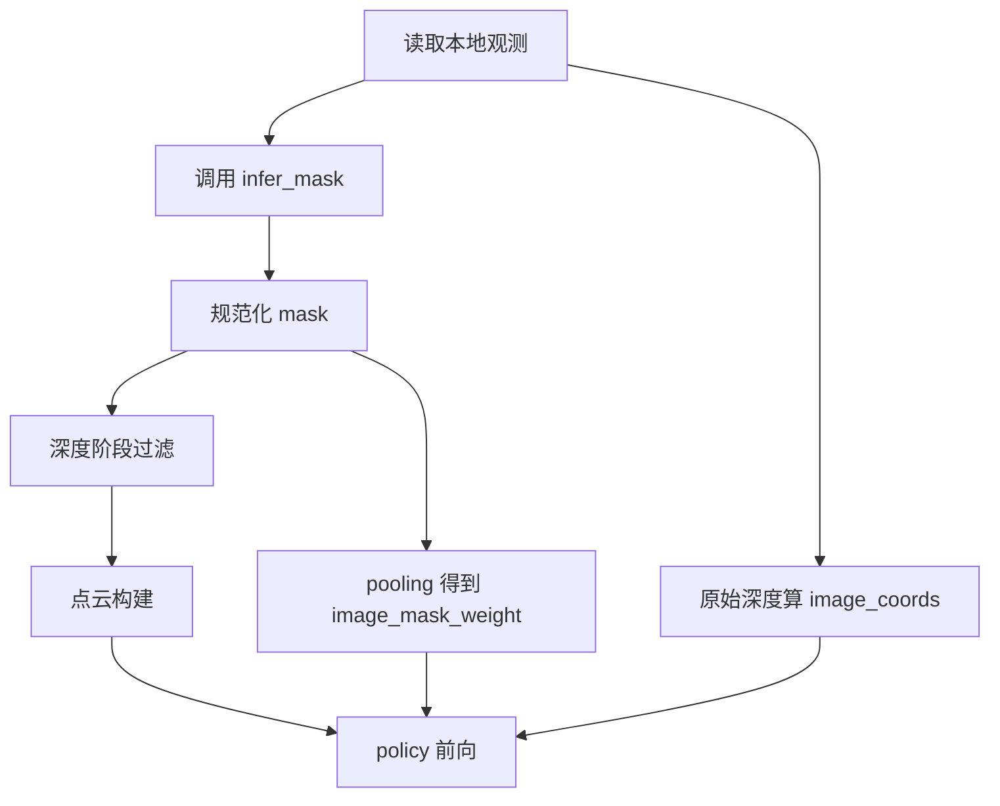

# Mask-Aware 本地推理实施约束 Spec v1

> 面向 Coding Agent 的可执行约束文档。
>
> 基线计划来源：[`plans/mask_aware_inference_plan.md`](plans/mask_aware_inference_plan.md:1)。
>
> 本文只约束本地推理，不包含远程链路。

---

## 0. 规范关键词

- MUST：必须满足，否则视为不合格实现。
- SHOULD：建议满足，不满足需有明确注释说明。
- MAY：可选能力，不阻塞主链路。

---

## 1. 目标与范围

### 1.1 目标

在本地推理入口 [`evaluate()`](eval.py:156) 接入训练端已存在的 mask-aware 语义，形成可回退、可观测、可验证的最小闭环：

- 方案A：3D 硬过滤（深度图阶段）
- 方案B：2D 软降权（patch 可靠度）

### 1.2 In Scope

- 仅允许修改 [`eval.py`](eval.py:1)（含在该文件内新增 helper 函数）。
- 允许复用已有接口：
  - [`create_input()`](eval.py:100)
  - [`create_point_cloud()`](eval.py:64)
  - [`ImageProcessor.get_image_coordinates()`](dataset/data_utils.py:243)
  - [`ImageProcessor.preprocess_images()`](dataset/data_utils.py:271)
  - [`RISE2.forward()`](policy/policy.py:52)

### 1.3 Out of Scope

本阶段 MUST NOT 修改以下远程路径：

- [`eval_server.py`](eval_server.py:1)
- [`WebsocketClientPolicy.infer()`](remote_eval/websocket_client_policy.py:33)
- [`WebsocketPolicyServer`](remote_eval/websocket_policy_server.py:10)

本阶段 SHOULD NOT 修改训练链路：

- [`train.py`](train.py:1)
- [`RealWorldDataset`](dataset/realworld.py:30)

---

## 2. 不可变语义约束

### 2.1 Mask 语义

- MUST：`mask01 == 1` 表示不可信区域。
- MUST：`mask01 == 0` 表示可信区域。
- MUST：默认阈值为 `mask_png > mask_threshold`，默认 `mask_threshold = 0`。

### 2.2 3D 过滤语义

- MUST：仅在深度图阶段过滤。
- MUST：过滤逻辑等价于 `depths_for_cloud[mask01 > 0.5] = 0`。
- MUST：`image_coords` 使用原始深度，不使用过滤后深度。

### 2.3 2D 降权语义

- MUST：`image_mask_weight = 1 - mask_ratio`。
- MUST：`image_mask_weight` 取值在 `[0,1]`。
- MUST：与 [`WeightedSpatialInterpolation.forward()`](policy/sparse_modules.py:72) 现有 `src_weights` 机制一致。

### 2.4 回退语义

- MUST：当 mask 不可用时，可完全回退到旧路径。
- MUST：默认回退策略为不使用 mask 继续推理，不崩溃。

---

## 3. 配置约束

### 3.1 必需配置键

在推理配置中读取 `mask_aware`（缺失时按默认值）：

- `mask_aware.enabled`：默认 `false`
- `mask_aware.enable_3d_filter`：默认 `true`
- `mask_aware.enable_2d_reweight`：默认 `true`
- `mask_aware.mask_threshold`：默认 `0`
- `mask_aware.mask_white_is_untrusted`：默认 `true`
- `mask_aware.r_min`：默认 `1e-3`
- `mask_aware.interp_eps`：默认 `1e-6`
- `mask_aware.interp_tiny`：默认 `1e-6`
- `mask_aware.infer_allow_none`：默认 `true`
- `mask_aware.infer_none_policy`：默认 `no_mask_fallback`

### 3.2 行为总开关

- MUST：`mask_aware.enabled = false` 时，行为与当前旧版本地推理一致。

---

## 4. 推理期 mask 接口契约

### 4.1 接口签名

在 [`eval.py`](eval.py:1) 内定义统一接口（先占位实现）：

```python
infer_mask(color, depth, proprio, meta) -> mask01 | None
```

### 4.2 输入约束

- `color`：当前帧 RGB。
- `depth`：当前帧 Depth。
- `proprio`：当前时刻本体状态。
- `meta`：可选上下文，包含时间戳、相机内参、帧索引等。

### 4.3 输出约束

- 返回 `None`：表示无 mask，可回退。
- 返回 mask：允许 `bool` `uint8` `float`，但 MUST 规范化为 `float32` 的 0/1。
- mask 分辨率与 depth 不一致时，MUST 最近邻 resize 到 depth 尺寸。

### 4.4 非法输出处理

- MUST：shape 维度异常时按 `infer_none_policy` 处理。
- SHOULD：打印单行告警，包含帧索引与输入输出 shape。

---

## 5. 本地数据流强约束

在每次循环中，按以下顺序执行：

1. 获取观测（`colors` `depths` `proprio`）。
2. 调用 `infer_mask`，得到 `mask01` 或 `None`。
3. 若 `enable_3d_filter=true` 且 `mask01` 可用：
   - 构造 `depths_for_cloud = copy(depths)`。
   - 执行深度阶段 mask 过滤。
4. 点云分支：
   - 点云构建使用 `depths_for_cloud`（若未启用则使用原始 `depths`）。
5. 图像坐标分支：
   - MUST 始终使用原始 `depths` 计算 [`ImageProcessor.get_image_coordinates()`](dataset/data_utils.py:243)。
6. 若 `enable_2d_reweight=true` 且 `mask01` 可用：
   - mask 对齐到图像分支尺度。
   - 使用 pooling 计算 `mask_ratio`。
   - 计算 `image_mask_weight = 1 - mask_ratio`。
7. 调用 [`RISE2.forward()`](policy/policy.py:52)：
   - 传入 `image_mask_weight`（或 `None`）。

---

## 6. 回退与异常处理矩阵

### 6.1 mask 获取失败

- 条件：`infer_mask` 返回 `None` 或抛异常。
- 默认策略 MUST：`no_mask_fallback`。
- 结果：禁用本帧 3D 过滤与 2D 降权，继续推理。

### 6.2 mask 尺寸不合法

- 条件：无法通过最近邻 resize 修复。
- 策略：与 6.1 相同。

### 6.3 3D 过滤后空点云

- 条件：过滤后有效点为 0。
- 默认策略 MUST：`warn_and_skip_filter`。
- 行为：本帧回退到未过滤深度重建点云。
- 可选策略 MAY：`fail_fast`。

### 6.4 数值稳定

- MUST：任何情况下不得出现 NaN 或 Inf。
- SHOULD：发生异常值时打印一次上下文摘要并触发回退。

---

## 7. 可观测性要求

### 7.1 启动日志

- SHOULD：在 [`evaluate()`](eval.py:156) 启动时打印 mask-aware 生效配置摘要。

### 7.2 帧级调试日志

- SHOULD：提供开关化调试日志，至少包含：
  - `mask_available`
  - `masked_ratio`
  - `cloud_points_before`
  - `cloud_points_after`
  - `used_fallback`

### 7.3 限流

- MUST：默认不开启高频日志，避免影响推理实时性。

---

## 8. 验证清单与验收标准

### P0 必须通过

1. 总开关回退
   - `mask_aware.enabled=false` 时，本地推理可正常运行。
2. None 回退
   - `infer_mask` 返回 `None` 时流程不中断。
3. 前向兼容
   - [`RISE2.forward()`](policy/policy.py:52) 可接收 `image_mask_weight` 或 `None`。
4. 数值稳定
   - 连续多帧无 NaN Inf。

### P1 建议通过

1. 功能可观测
   - 开启 3D 过滤时可看到点数变化统计。
2. 权重范围正确
   - `image_mask_weight` 始终在 `[0,1]`。
3. 质量保护
   - 极端高 mask 比例时按策略回退，不崩溃。

### P2 可选

1. 合成全白 mask 压测
   - 验证边界回退路径。
2. 动态 mask 抖动测试
   - 评估动作稳定性影响。

---

## 9. Coding Agent 实施步骤

1. 在 [`eval.py`](eval.py:1) 增加 `mask_aware` 配置读取与默认值。
2. 在 [`eval.py`](eval.py:1) 增加 `infer_mask` 占位函数与 mask 规范化工具函数。
3. 在 [`evaluate()`](eval.py:156) 中插入 mask 获取、3D 过滤与 2D 降权分支。
4. 确保 [`create_input()`](eval.py:100) 调用使用正确深度版本。
5. 确保 policy 调用传递 `image_mask_weight` 参数。
6. 增加最小日志与回退逻辑。
7. 依据第 8 节执行 P0 验证并记录结果。

---

## 10. 禁止项

以下行为在本阶段禁止：

- 修改远程推理协议或远程 server 逻辑。
- 修改训练数据集读取逻辑以适配推理。
- 改变 `mask01` 语义定义。
- 把 3D 过滤移动到点云生成之后。

---

## 11. Mermaid 流程图



---

## 12. 完成定义

满足以下条件即视为本地推理 spec 达标：

1. 仅本地 [`eval.py`](eval.py:1) 范围改造，不触碰远程链路。
2. 3D 过滤与 2D 降权语义与训练端一致。
3. 默认回退可用，且可一键关闭恢复旧行为。
4. P0 验证项全部通过并有记录。
