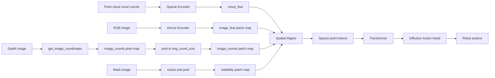

# Mask-Aware RISE-2 Policy 改造规划（基于本仓库实现）

> 目标：在 RISE-2 的 **Spatial Aligner / Weighted Spatial Interpolation** 融合环节显式注入 inpaint mask 信息，让模型在融合 2D 语义特征时对被修补区域降权或剔除。
>
> 本文档面向“按图索骥读代码 + 落地实现”。不包含具体代码实现，但把改动点、接口、张量形状、验证方法写清楚。

---

## 0. RISE-2 当前端到端数据流（你需要先建立的心智模型）

训练时主链路见 [`train.train()`](../train.py:29)：

- dataset 输出：
  - 点云：`cloud_coords/cloud_feats` → `ME.SparseTensor`
  - 图像：`image_feats`（实际是 RGB image tensor）
  - 对齐坐标：`image_coords`（每个 2D patch 对应的 3D 坐标）
  - 监督：`action_normalized`
- policy 前向：`loss = policy(cloud_data, image, image_coords, actions=action_data)` 见 [`train.py`](../train.py:147)

policy 主干见 [`RISE2.forward()`](../policy/policy.py:52)：

1. Dense encoder：[`DINOEncoder`](../policy/dense_modules.py:75) / [`ResNetEncoder`](../policy/dense_modules.py:51) 输出 `image_feat: (B, Ci, Hf, Wf)`
2. 展平为 patch token：`(B, m, Ci)`，其中 `m=Hf*Wf`
3. Sparse encoder：[`SparseEncoder`](../policy/sparse_modules.py:160)
4. SpatialAligner：[`SpatialAligner.forward()`](../policy/sparse_modules.py:184) 将 2D feature 通过 3D 空间 kNN 插值融合到 3D token
5. Transformer + Diffusion action head 输出动作（不是本文重点）

论文图示与仓库实现对应关系：你贴的 Figure（`RISE-2` 模型结构图）中 **Spatial Aligner** 对应本仓库的 [`SpatialAligner`](../policy/sparse_modules.py:171) + [`WeightedSpatialInterpolation`](../policy/sparse_modules.py:66)。

---

## 1. 关键概念：`image_coords` 的意义与来龙去脉（为什么能做 2D↔3D 对齐）

### 1.1 `image_coords` 是什么

`image_coords` 是一个 **3 通道的坐标图**，每个位置存 (x,y,z)：

- 由深度图反投影得到，见 [`ImageProcessor.get_image_coordinates()`](../dataset/data_utils.py:243)
- 输出形状：`(3, h, w)`（注意这不是 batch 维）见 [`dataset/data_utils.py`](../dataset/data_utils.py:267)

### 1.2 为什么要 resize + pool 到 `img_coord_size`

Dense encoder 的 feature map 分辨率是 `Hf×Wf`（patch 级），不是原像素级。RISE-2 要把 2D feature 与 3D 点在 3D 空间对齐，因此必须让每个 patch 对应一个 3D 坐标。

实现路径在 [`ImageProcessor.preprocess_images()`](../dataset/data_utils.py:271)：

- 图像：resize 到 `config.data.aligner.img_size_*`，再归一化
- 坐标：
  1) `coords = np.stack(coords, axis=0)`（把 `(3,h,w)` 变成 `(1,3,h,w)`）
  2) `coords /= voxel_size`（统一到 voxel 尺度）
  3) `coords = AdaptiveAvgPool2d(img_coord_size)(coords)`（把像素级坐标池化为 patch 级坐标）

池化后的 `coords` 形状是 `(1, 3, Hf, Wf)`。

### 1.3 为什么要 `/ voxel_size`

点云侧进入 MinkowskiEngine 前也会做 `points / voxel_size` 得到 voxel 坐标，见 [`dataset/realworld.py`](../dataset/realworld.py:318)。

SpatialAligner 内会计算 3D 距离权重 `1/(dist+eps)`（见 [`WeightedSpatialInterpolation.forward()`](../policy/sparse_modules.py:72) 与 [`policy/sparse_modules.py`](../policy/sparse_modules.py:98)）。为了让距离量纲一致、不同 `voxel_size` 配置下插值行为稳定，作者把 image_coords 同样缩放到 voxel 坐标系。

### 1.4 policy 侧的 shape check

在 [`RISE2.forward()`](../policy/policy.py:52) 中强制要求：

- `image_feat.shape[2:4] == image_coord.shape[2:4]`

否则直接抛错，见 [`policy/policy.py`](../policy/policy.py:62)。

这就是 `img_coord_size_*` 在 config 中必须与 encoder 输出分辨率严格对应的原因（例如 DINOv2 patch_size=14，`252/14=18`，`448/14=32`）。

---

## 2. Mask-Aware 的设计目标（把学长建议翻译成工程目标）

你给的“哈基米解释”核心结论是正确的：mask 不该作为最终 feature 的额外维度拼接（那只是加了输入），而应该作为 **插值权重** 干预融合过程。

参考解释文档 [`哈基米解释mask-aware policy.md`](../哈基米解释mask-aware%20policy.md:65)：

- 原权重：只看距离 `w ∝ 1/dist`
- 新权重：距离权重 × 可信度 `w ∝ (1/dist) * reliability`
- reliability 可由 patch 内 mask 占比得到：`reliability = 1 - mask_ratio`

工程上拆成两条路线（可单独开关，便于 ablation）：

1) **3D 侧剔除**：删掉落在 mask 区域的点（或在稀疏张量里屏蔽）
2) **2D 侧降权**：对被 mask 的 patch 低权重，直接改 [`WeightedSpatialInterpolation`](../policy/sparse_modules.py:66) 的权重公式

---

## 3. 改造点全览（文件级别）

### 3.1 数据侧（必须）

你需要让 dataset 额外返回 mask（或 patch 级 reliability map）。最小改动路径：

- 修改 [`RealWorldDataset.__getitem__()`](../dataset/realworld.py:229) ：
  - 读取 mask PNG（黑白）
  - 经过与图像一致的 resize
  - pool 到 `img_coord_size_*` 生成 patch 级 `mask_ratio` 或 `reliability`
  - 返回新增字段，例如：`image_mask` 或 `image_mask_weight`

建议新增 key 名：
- `image_mask_weight`: float32，形状建议与 `image_coords` 空间一致：`(1, Hf, Wf)` 或 `(Hf, Wf)`

### 3.2 Policy 接口（必须）

修改 [`RISE2.forward()`](../policy/policy.py:52) 的签名，增加可选参数：
- `image_mask_weight=None`

并把它传到 [`SpatialAligner.forward()`](../policy/sparse_modules.py:184)。

### 3.3 SpatialAligner / WeightedInterpolation（必须）

**唯一必须改权重的落点**：[`WeightedSpatialInterpolation.forward()`](../policy/sparse_modules.py:72)

目前实现：
- 找 kNN patch
- `weight = 1/(dist+eps)`
- 归一化后加权求和

改为：
- `weight = (1/(dist+eps)) * reliability_knn`
- 再归一化

其中 `reliability_knn` 是从 patch 级 mask weight map 中按 kNN index gather 出来的 `(n,k)`。

### 3.4 3D 点剔除（可选，建议作为 ablation）

如果你已经能获得“3D 哪些点属于 mask 区域”的标注：

- 最自然位置是 dataset 生成点云后、voxel 化前：在 [`RealWorldDataset.load_point_cloud()`](../dataset/realworld.py:197) 或 `__getitem__` 中对 `points/colors` 做过滤。
- 若只有 2D mask：可在生成点云时保留“每个点对应的像素坐标”来过滤，但当前 `open3d.create_from_rgbd_image` 不直接返回像素索引，需要你额外实现映射（工程量更大）。因此建议先做 2D 降权路线。

---

## 4. 具体接口设计草案（张量形状约定）

### 4.1 2D mask → patch reliability 的推荐计算

输入：
- `mask_img`: (H0, W0) 或 (1,H0,W0)，值域：0 表示真实，1 表示被 inpaint（或相反，需统一）

处理：
1) resize 到 `img_size`（与 RGB 一致）
2) 转 float32，归一到 `[0,1]`
3) `mask_ratio = AdaptiveAvgPool2d(img_coord_size)(mask)` → `(1,Hf,Wf)`
4) `reliability = 1 - mask_ratio`

注意：如果你的 mask 语义相反（1 表示真实），就把公式翻转。

### 4.2 在 policy 内部的对齐

在 [`RISE2.forward()`](../policy/policy.py:52) 中，`image_feat` 与 `image_coord` 都会被 flatten 成 `(B,m,*)`。

为了融合方便，建议同样 flatten：
- `image_mask_weight: (B, m)`

然后在 [`SpatialAligner.forward()`](../policy/sparse_modules.py:184) 的 per-sample 循环里，拿到 `image_mask_weight_i: (m,)`。

### 4.3 kNN gather 语义

在 [`WeightedSpatialInterpolation.forward()`](../policy/sparse_modules.py:72) 中 `selected_idxs` 形状 `(n,k)` 表示：每个 3D 点选择的 k 个 patch index。

因此：
- `reliability_knn = reliability[selected_idxs]` → `(n,k)`
- 与 `all_dists[:, :k]` 形状对齐

---

## 5. 验证与 Debug 清单（最小可用）

### 5.1 维度/接口正确性

1) dataset 返回新增 key 后，确认 [`collate_fn()`](../dataset/realworld.py:340) 会把它 stack 成 tensor（把 key 加入 `TO_TENSOR_KEYS`，见 [`dataset/realworld.py`](../dataset/realworld.py:18)）。
2) 确认训练循环从 `data[...]` 取到该字段并传入 policy。
3) 确认 policy 内部 flatten 后 `m` 一致（与 `image_feat.flatten(2)` 同长度）。

### 5.2 数值 sanity

1) 人工构造 mask：全 0 → reliability 全 1，应退化为原版行为。
2) 全 1 → reliability 全 0：需要决定策略（避免所有权重为 0）：
   - 方案 A：加一个 epsilon floor，例如 `reliability = clamp(reliability, min=1e-3)`
   - 方案 B：若某点的 k 个邻居 reliability 全 0，则回退到纯距离权重

建议先实现回退策略，避免训练不稳定。

### 5.3 可视化辅助（强烈建议）

- 把 patch reliability map 上采样到输入图像大小进行可视化，确认空间对齐没错。
- 随机采样 3D 点，打印其 kNN patch index，对应 reliability 与 dist，确认权重逻辑生效。

---

## 6. 风险点与工程注意事项

1) **尺度与坐标系**：`image_coords` 与点云 coords 都在 voxel 尺度，但二者是否在同一坐标系（相机系）取决于你点云生成与裁剪的实现。当前实现是相机内参反投影 + workspace crop，保持一致。
2) **DINO patch size 强耦合**：`img_size` 必须可被 patch_size 整除，否则 grid_H/W 会不匹配（当前 config 已处理）。
3) **插值实现复杂度**：当前 WeightedSpatialInterpolation 是 O(n*m)（每个点到每个 patch），但 n、m 都被控制在较小范围（m=576 左右）。mask-aware 不改变复杂度。
4) **BatchNorm 稳定性**：CHANGELOG 提到 SpatialAligner 的 BN 多次 forward 会影响稳定性（见 [`assets/docs/CHANGELOG.md`](../assets/docs/CHANGELOG.md:47)）。mask-aware 改动应尽量不引入新的 per-sample BN forward。

---

## 7. 实施步骤（对应可执行 TODO）

1) 数据准备：确定 mask 文件命名/目录结构（teleop/wild 各一套）
2) dataset：读取 mask，并在 [`ImageProcessor`](../dataset/data_utils.py:208) 中新增 mask preprocess（或在 dataset 内实现）
3) collate：把新增字段加入 `TO_TENSOR_KEYS`
4) policy：扩展 [`RISE2.forward()`](../policy/policy.py:52) 与调用链
5) aligner：扩展 [`SpatialAligner.forward()`](../policy/sparse_modules.py:184) 传递 mask weight
6) interpolation：在 [`WeightedSpatialInterpolation.forward()`](../policy/sparse_modules.py:72) 融合 reliability
7) 加入回退/防 NaN 机制（全 0 reliability 情况）
8) 最小验证：用全 0 mask / 全 1 mask 的 sanity case，确认行为退化与稳定
9) ablation：可选加入 3D 点剔除路线，与 2D 降权组合对比

---

## 8. Mermaid：模块与数据流（便于你对照代码读）

---

## 9. 你接下来需要给我的最小信息（便于把规划进一步落地）

- mask 文件在你的数据目录里具体路径与命名（例如 `cam_xxx/mask/ts.png` 还是别的）
- mask 语义：白色是 inpaint 还是黑色是 inpaint
- wild 数据是否同时有 `color_controlnet`/`depth_inpainting` 对应的 mask（否则先从 teleop 路线验证）
