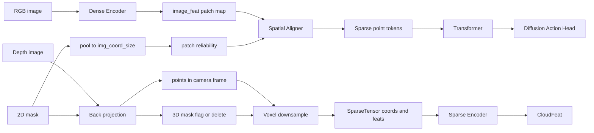

# Mask-Aware RISE-2 Policy 改造规划 v2（2D mask 精确生成 3D mask 点云 + 2D 降权融合）

> 本文档是对 [`plans/mask_aware_policy_plan.md`](mask_aware_policy_plan.md:1) 的增强版：保留原文件不动，新建 v2。
>
> v2 的核心立场：**只要有 2D mask + 深度图，就能在生成点云时精确知道每个点对应的像素坐标，从而精确过滤/标注 3D 点云的 mask 区域。**
>
> 目标读者：另一个 AI agent / 工程同学看完可以直接开工。
>
> 约束：本文档不直接改代码，但必须给出明确的函数落点、I/O 约定、边界条件、验证方法。

---

## 0. 你要实现的能力（Definition of Done）

实现一个可配置开关的 mask-aware 数据与 policy 流水线，满足：

1) **3D 点云 mask（精确）**：对每个点云点 `p`，知道它来自图像哪个像素 `(u,v)`，从而：
- 方案 A：直接删除 mask 区域点云（hard delete）
- 方案 B：保留点云但提供 per-point mask/reliability（soft keep）

2) **2D patch mask（精确到 patch 统计）**：对每个 2D encoder 的 patch token，计算其 mask 占比 `mask_ratio` 与可信度 `reliability = 1 - mask_ratio`。

3) **融合处降权（必做）**：在 [`WeightedSpatialInterpolation.forward()`](../policy/sparse_modules.py:72) 里把距离权重乘以 `reliability_knn`。

4) **工程稳定性**：全 mask / 局部 mask 场景下不出现 NaN，不出现全 0 权重导致的除 0。

5) **可验证**：提供最小单元测试/可视化脚本或 debug 打印点，能确认 mask 在 2D、3D、融合权重三处一致。

---

## 1. 现有实现复盘（必须先对齐现状）

### 1.1 数据输入现状

Dataset 见 [`RealWorldDataset.__getitem__()`](../dataset/realworld.py:229)：
- 图像 `colors` 来自 `color_dir/*.png`
- 深度 `depths` 来自 `depth_dir/*.png`
- 点云由 `open3d.create_from_rgbd_image` 生成并 voxel downsample（见 [`load_point_cloud()`](../dataset/realworld.py:197)）
- `image_coords` 由深度反投影得到 `(3,h,w)`，并在 [`ImageProcessor.preprocess_images()`](../dataset/data_utils.py:271) 中：
  - 先除以 `voxel_size`
  - 再用 `AdaptiveAvgPool2d(img_coord_size)` 池化到 `(1,3,Hf,Wf)`

Policy 见 [`RISE2.forward()`](../policy/policy.py:52)：
- `image_feat` 输出 `(B,C,Hf,Wf)`
- 强制 `image_feat.shape[2:4] == image_coord.shape[2:4]`（见 [`policy/policy.py`](../policy/policy.py:62)）

### 1.2 当前融合权重

融合处在 [`WeightedSpatialInterpolation.forward()`](../policy/sparse_modules.py:72)：
- kNN：对每个 3D 点，找最近 k 个 patch（在 3D 空间里基于 `image_coord`）
- 权重：`w = 1/(dist+eps)`，归一化后加权求和（见 [`policy/sparse_modules.py`](../policy/sparse_modules.py:98)）

---

## 2. 关键改造：用 2D mask 精确得到 3D 点云 mask（你提出的新主张）

### 2.1 为什么是可行且精确的

点云来自深度图：每个点 `(x,y,z)` 都由某个像素 `(u,v)` 的深度通过内参反投影得到（与 [`get_image_coordinates()`](../dataset/data_utils.py:243) 的公式一致）。

因此，只要你在生成点云的过程中保留像素索引 `(u,v)`，就能：
- 从 2D mask 直接查询该像素是否被 mask
- 对应地删除/标注该点云点

这比“事后再去 3D 空间投影回 2D”更直接，更不易引入数值误差。

### 2.2 必须改变的事实：当前 `open3d.create_from_rgbd_image` 丢失像素索引

现有 [`load_point_cloud()`](../dataset/realworld.py:197) 用 Open3D 直接生成点云，Open3D 的 `PointCloud` 只保留 `points/colors`，不保留每个点来自哪个像素。

所以要实现“像素级精确过滤”，你需要 **改造点云生成函数**：用你自己的 back-projection（numpy/torch）生成点云，并显式保留 `(u,v)`。

> 约束：不能依赖 Open3D 自动生成点云后再反推像素索引，因为 voxel downsample/crop 后点不再与像素一一对应。

### 2.3 推荐实现：自定义 back-projection 生成点云 + 像素索引

新增一个函数（位置建议在 [`dataset/data_utils.py`](../dataset/data_utils.py:1) 或新文件 `dataset/mask_utils.py`）：

- 输入：
  - `colors: (H,W,3) uint8`
  - `depths: (H,W) uint16/float32`
  - `intrinsics: (3,3)`
  - `depth_scale`
  - `workspace_min/max`（相机坐标系）
  - `voxel_size`
  - 可选 `rescale_factor`（保持与现有一致）
  - **mask**：`mask: (H,W) {0,1}` 或 `[0,255]`

- 输出：
  - `points: (N,3) float32`（相机坐标系，米）
  - `colors: (N,3) uint8/float32`
  - `uv: (N,2) int32`（像素坐标，基于 resize 后的深度图坐标系）
  - `mask_flag: (N,) bool`（该点是否来自 mask 像素）

实现步骤（必须按顺序）：

1) **对齐分辨率**：如果你像现有代码一样对深度/图像做 `rescale_factor`（见 [`load_point_cloud()`](../dataset/realworld.py:197) 里 rescale_factor=0.5），则 mask 也必须以同样方式 resize（最近邻）。

2) **生成像素网格**：
- `u = [0..W-1], v=[0..H-1]`
- meshgrid 得到 `(v,u)`

3) **反投影**（与 [`get_image_coordinates()`](../dataset/data_utils.py:243) 一致）：
- `z = depth / depth_scale`
- `x = (u - cx)/fx * z`
- `y = (v - cy)/fy * z`

4) **有效深度过滤**：`z>0`。

5) **workspace crop**：只保留落入 `workspace_min/max` 的点（这一步必须在米单位下做，保持与原实现一致）。

6) **mask 过滤/标注**：
- `mask_flag = mask[v,u] > thresh`
- 方案 A：hard delete：只保留 `~mask_flag` 的点
- 方案 B：soft keep：保留点，但输出 `mask_flag`

7) **voxel downsample（重要）**：你需要自己实现 voxel 下采样，同时维护 mask_flag 的传播策略。

#### 2.3.1 voxel downsample 的传播策略（必须写清）

对于落在同一 voxel 的多个点，需要聚合为 1 个代表点。你必须决定：

- 代表点坐标：均值（推荐）或取第一个
- 代表点颜色：均值
- 代表点 uv：可丢弃（下采样后 uv 不再唯一），或保留均值 uv 仅用于 debug
- 代表点 mask_flag：
  - **策略 S1（推荐，保守）**：voxel 中只要存在 mask 点，则该 voxel 标记为 mask（`any`）
  - 策略 S2：按 mask 占比给出 reliability（`1 - mean(mask)`）

建议实现 S2，因为它自然对应“3D soft weight”。

输出 `pcd_mask_weight_3d: (N_voxel,) float32`，取值 `[0,1]`，其中 1 表示可信。

### 2.4 与 MinkowskiEngine 输入对接

现有输入是：
- `coords = points/voxel_size`（int32）
- `feats = points.astype(float32)`

mask-aware 3D 路线有两种：

- Hard delete：生成 `points` 前就把 mask 点删掉 → 直接沿用旧逻辑
- Soft keep：
  - 方案：把 `mask_weight_3d` 作为额外 feature 拼到 `cloud_feats`（会改变 sparse encoder 输入通道数，需要改 Minkowski ResNet in_channels，从 3→4，不推荐作为第一版）
  - 更推荐：仍 hard delete（与你的主张一致：有 mask 就能精确删点）

**v2 推荐**：3D 路线优先 hard delete，工程最简单、影响最直接。

---

## 3. 2D patch mask（仍然必须做）

即便你在 3D 上 hard delete，2D feature 仍可能包含被 inpaint 的区域语义，且融合时会被 kNN 选中。所以 2D patch reliability 仍是必要的。

实现方式沿用 v1：

- mask resize 到 `img_size`
- `mask_ratio = AdaptiveAvgPool2d(img_coord_size)(mask)`
- `reliability = 1 - mask_ratio`

输出字段建议：
- `image_mask_weight: (1, Hf, Wf)` float32

并在插值时参与权重：
- `w = (1/(dist+eps)) * reliability_knn`，归一化。

---

## 4. 需要修改的文件/函数（按实施顺序列出，另一个 agent 可照做）

### 4.1 Dataset：新增 mask 读取与传递

文件：[`dataset/realworld.py`](../dataset/realworld.py:1)

改动点：[`RealWorldDataset.__getitem__()`](../dataset/realworld.py:229)

- 在读取 `colors/depths` 后，读取 `mask`：
  - 你需要定义 mask 路径规则（teleop/wild 可能不同）
  - mask 必须与 depth 对齐（同一 timestamp）

- 替换点云生成：
  - 用“自定义 back-projection + mask 过滤 + voxel downsample”取代 [`load_point_cloud()`](../dataset/realworld.py:197) 的 Open3D 版本

- 生成 patch reliability：
  - 通过 `ImageProcessor` 新增接口或在 dataset 内实现

- 返回新增 key：
  - `image_mask_weight`

### 4.2 Collate：把新增 key 纳入 tensor stack

文件：[`dataset/realworld.py`](../dataset/realworld.py:1)

- 在 `TO_TENSOR_KEYS` 中加入 `image_mask_weight`，见 [`dataset/realworld.py`](../dataset/realworld.py:18)

### 4.3 Train loop：把 mask weight 传给 policy

文件：[`train.py`](../train.py:1)

- 在取 batch 时取出 `image_mask_weight = data['image_mask_weight']`
- 调用 policy 时传参（需要 policy 支持新签名）

### 4.4 Policy：扩展 forward 签名与传递链路

文件：[`policy/policy.py`](../policy/policy.py:1)

- 修改 [`RISE2.forward()`](../policy/policy.py:52) 增加 `image_mask_weight=None`
- flatten 后把 `image_mask_weight` 也 flatten 成 `(B,m)`
- 传到 [`SpatialAligner.forward()`](../policy/sparse_modules.py:184)

### 4.5 SpatialAligner：接收并传给插值模块

文件：[`policy/sparse_modules.py`](../policy/sparse_modules.py:1)

- 修改 [`SpatialAligner.forward()`](../policy/sparse_modules.py:184) 签名接收 `image_mask_weight=None`
- per-sample 取出 `image_mask_weight_i` 并传给 `self.interp(...)`

### 4.6 WeightedSpatialInterpolation：权重公式改造

文件：[`policy/sparse_modules.py`](../policy/sparse_modules.py:1)

- 修改 [`WeightedSpatialInterpolation.forward()`](../policy/sparse_modules.py:72) 签名接收 `src_weights=None`（对应 patch reliability）
- 在选出 `selected_idxs` 后 gather：`selected_w = src_weights[selected_idxs]` 得 `(n,k)`
- 改权重：
  - `weight = (1/(dist+eps)) * selected_w`
  - 归一化前处理全 0：若某行 sum==0，回退到纯距离权重或加 epsilon floor

---

## 5. 关键约束与边界条件（必须写死，避免实现偏差）

1) **mask 的语义必须统一**：约定 `mask==1` 表示 inpaint 区域（不可信）。若你的数据相反，需要在读取时取反。
2) **mask 与 depth 必须同分辨率同坐标系**：若 depth 做了 resize/rescale_factor，mask 必须用最近邻同步处理。
3) **workspace crop 必须在米单位做**：保持与现有 Open3D crop 行为一致（见 [`dataset/realworld.py`](../dataset/realworld.py:223)）。
4) **voxel downsample 后 uv 不再一一对应**：因此 3D mask 最终应是 voxel-level 的 any/mean 聚合结果，而不是单一像素索引。
5) **插值全 0 权重必须回退**：否则会产生 NaN 并污染训练。

---

## 6. 验证计划（必须能定位问题）

### 6.1 单样本可视化（最重要）

对一个 sample：
- 可视化 2D：RGB 上叠加 mask
- 可视化 3D：点云中被删掉/被标注为 mask 的点用不同颜色显示

验收标准：
- 2D mask 区域对应的 3D 点云确实被删掉或被标注

### 6.2 数值 sanity

- mask 全 0：应严格退化为原始 pipeline（点数、loss 数值量级接近）
- mask 全 1：
  - 3D hard delete：点云可能为空，需要定义 fallback（例如保留最小数量点或跳过样本）
  - 2D reliability 全 0：插值必须回退到纯距离权重（或 clamp）

### 6.3 融合权重检查

在 [`WeightedSpatialInterpolation.forward()`](../policy/sparse_modules.py:72) 中临时 debug：随机取几个 3D 点打印：
- kNN dist
- selected_w
- weight 归一化前后

验收标准：mask 区域 patch 的 `selected_w` 更低，导致最终融合贡献更小。

---

## 7. Mermaid：v2 数据流（含 2D mask→3D 点云过滤）

---

## 8. 需要你补充的唯一信息（否则实现会走偏）

为了让另一个 agent 直接开工，你需要在开工前固定以下协议（写进实现注释/README）：

1) mask 文件路径规则（teleop 与 wild 的目录名、文件后缀、与 timestamp 的对应关系）
2) mask 像素语义（1 是 inpaint 还是 0 是 inpaint）
3) 深度的 `depth_scale` 是否总是 1000（当前 `get_image_coordinates()` 强制写死 1000，见 [`dataset/data_utils.py`](../dataset/data_utils.py:253)；如果你的数据不同，需要统一）

