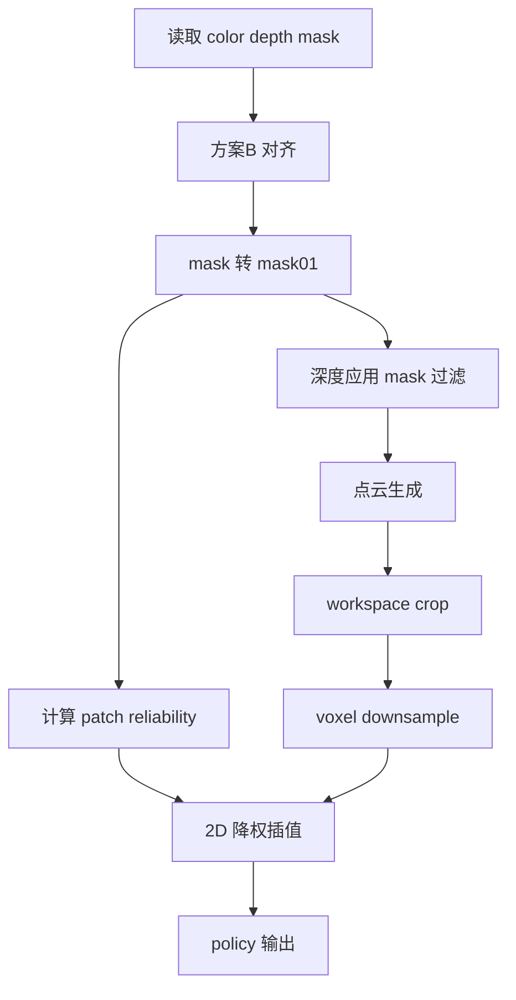

# Mask-aware RISE-2：v4 细化实现规范

> 文档目标：在不改动现有 `.py` 代码的前提下，给出可直接落地的实现规范，并对旧文档中的过强约束做降级或移除。
>
> 关联旧文档：[`plans/mask_aware_policy_plan.md`](mask_aware_policy_plan.md)、[`plans/mask_aware_policy_plan_v2_2dmask_to_3dfilter.md`](mask_aware_policy_plan_v2_2dmask_to_3dfilter.md)、[`plans/mask_aware_policy_spec_v3.md`](mask_aware_policy_spec_v3.md)。

---

## 0. 规范关键词

- MUST：必须满足，否则视为实现不合格。
- SHOULD：建议满足，不满足需有明确理由。
- MAY：可选能力，用于实验或增强。

本 v4 的原则：
- 保留关键正确性约束。
- 降低对难以稳定复现场景的硬性要求。
- 明确 P0 P1 P2 验证分级，避免把低必要性项写成阻塞门槛。

---

## 1. 旧文档逐条复查与修订决议

### 1.1 来自 v1 计划文档的修订

来源：[`plans/mask_aware_policy_plan.md`](mask_aware_policy_plan.md)

1. [`§5.2 全 1 mask sanity`](mask_aware_policy_plan.md:180)
   - 原倾向：接近必测。
   - v4 调整：降级到 P2。
   - 理由：真实数据中几乎不出现整帧全白 mask，但实现仍需有数值兜底。

2. [`§5.3 可视化辅助 强烈建议`](mask_aware_policy_plan.md:187)
   - 原倾向：接近上线前必须做。
   - v4 调整：定位为 SHOULD，归入 P1。
   - 理由：有助定位问题，但不应阻塞主功能交付。

3. [`§7 步骤8 全 0/全 1 极端 case`](mask_aware_policy_plan.md:212)
   - 原倾向：最小验证必做。
   - v4 调整：全 0 保留为 P1，全 1 降级 P2。
   - 理由：全 1 属于异常边界，重点改为“运行稳定且有告警”。

### 1.2 来自 v2 计划文档的修订

来源：[`plans/mask_aware_policy_plan_v2_2dmask_to_3dfilter.md`](mask_aware_policy_plan_v2_2dmask_to_3dfilter.md)

1. [`§2.2 必须改成自定义 back projection 并保留 uv`](mask_aware_policy_plan_v2_2dmask_to_3dfilter.md:67)
   - 原约束：MUST。
   - v4 调整：降为 MAY。
   - 理由：先对深度按 mask 置零再走现有点云流程，也能实现像素级精确删点，侵入更小。

2. [`§2.3.1 voxel 聚合传播策略必须写死`](mask_aware_policy_plan_v2_2dmask_to_3dfilter.md:119)
   - 原约束：MUST。
   - v4 调整：仅在 soft keep 路线下为 SHOULD，其余场景 MAY。
   - 理由：hard delete 主路径不依赖 voxel 级 mask 聚合语义。

3. [`§6.2 mask 全 0 严格退化原始 pipeline`](mask_aware_policy_plan_v2_2dmask_to_3dfilter.md:253)
   - 原约束：接近严格一致。
   - v4 调整：降为 P1 近似一致。
   - 理由：浮点与采样细节下严格逐值一致不现实，要求行为一致更合理。

4. [`§6.2 mask 全 1 专项检查`](mask_aware_policy_plan_v2_2dmask_to_3dfilter.md:254)
   - 原约束：必测。
   - v4 调整：降级到 P2。
   - 理由：低概率异常场景，保留为可选健壮性验证。

### 1.3 来自 v3 规范文档的修订

来源：[`plans/mask_aware_policy_spec_v3.md`](mask_aware_policy_spec_v3.md)

1. [`§1 阈值必须 >0 且禁止其他阈值`](mask_aware_policy_spec_v3.md:36)
   - 原约束：过强。
   - v4 调整：默认阈值为 `>0`，但阈值 SHOULD 可配置。
   - 理由：不同 mask 生成链路可能存在灰度噪声。

2. [`§4 A B 两路径都必须支持且默认都开`](mask_aware_policy_spec_v3.md:117)
   - 原约束：过强。
   - v4 调整：2D 降权路径 MUST；3D 过滤路径 SHOULD，并保持独立开关。
   - 理由：先保证最小可用，再逐步开启 3D 过滤更稳妥。

3. [`§8 检查3 同帧启停后点数必须显著减少`](mask_aware_policy_spec_v3.md:250)
   - 原约束：MUST。
   - v4 调整：降为 P2。
   - 理由：依赖数据分布和场景，不能作为硬门槛。

4. [`§8 检查4 全白 mask 下 NaN Inf 且 R1 R2 专项`](mask_aware_policy_spec_v3.md:251)
   - 原约束：MUST。
   - v4 调整：降为 P2；默认仅采用 `r_min` 方案，不把 R1 R2 设为默认。
   - 理由：你已确认该项必要性低，且 v3 已将默认稳定策略转为 `r_min`。

5. [`§2.2 对齐日志必须打印首尾映射`](mask_aware_policy_spec_v3.md:73)
   - 原约束：MUST。
   - v4 调整：SHOULD。
   - 理由：保留可观测性，但不作为阻塞条件。

---

## 2. 术语与语义约定

1. mask01
   - 定义：由灰度 mask 转二值得到。
   - 语义：`mask01 == 1` 表示不可信区域，`mask01 == 0` 表示可信区域。
   - 阈值：默认 `mask_threshold = 0`，即 `mask_png > mask_threshold` 判为 1。

2. reliability
   - 定义：可信度，范围 `[0, 1]`，数值越大越可信。
   - patch 级计算：`reliability = 1 - mask_ratio`。

3. 语义一致性要求
   - MUST：同一训练评估任务内，mask 语义不得切换。
   - SHOULD：在配置中显式声明 `mask_white_is_untrusted`。

---

## 3. 数据对齐规则

采用方案 B：排序后一一对应。

对每个 scene：
1. 读取 color 帧列表并排序。
2. 读取 mask 帧列表并排序。
3. MUST：长度一致。
4. MUST：按同 index 映射，`color[i]` 对应 `mask[i]`。
5. SHOULD：记录一次对齐摘要日志，包含 scene 名、数量、首尾映射。

异常处理：
- 长度不一致时，默认策略 MUST 为 fail fast。
- MAY：提供配置把该 scene 标记为不可用并跳过，但必须打印告警。

---

## 4. 深度尺度一致性策略

核心要求：单一真值来源。

1. MUST：同一帧上，以下三条路径使用同一个 `depth_scale`：
   - 2D depth 到 3D 点云生成
   - `image_coords` 计算
   - mask 参与的 2D 到 3D 过滤路径

2. SHOULD：优先使用统一来源字段，如 `depth_scale_source`。

3. MAY：若历史数据只支持固定尺度，可临时统一为 1000，但必须在配置中明确，并保证三条路径一致。

---

## 5. 2D 到 3D 精确过滤流水线

### 5.1 输入输出定义

输入：
- color 帧
- depth 帧
- mask 帧
- 相机内参
- depth_scale
- workspace 与 voxel 参数

输出：
- 过滤后的点云坐标与特征
- patch 级 `reliability`
- 调试统计信息，如有效点数与过滤比例

### 5.2 MUST 顺序

1. 分辨率对齐
   - color depth mask 进入同一坐标系。

2. mask 二值化
   - 生成 `mask01`。

3. 深度有效性与 mask 过滤
   - 先去除无效深度。
   - 再去除 `mask01 == 1` 的像素对应深度。

4. 点云生成
   - 从保留下来的深度生成 3D 点。

5. workspace crop。

6. voxel downsample。

7. 空点云处理
   - 若过滤后为空：MUST 输出告警。
   - 默认策略：SHOULD 跳过该样本，避免训练崩溃。

### 5.3 实现路线选择

- 路线 F1 最小侵入，SHOULD：
  - 先在深度图上应用 mask 过滤，再沿用现有点云生成流程。

- 路线 F2 增强可观测，MAY：
  - 自定义 back projection 并保留 uv 映射，用于更细粒度调试。

---

## 6. 2D patch 降权与插值公式

1. patch 可靠度
   - 对 `mask01` 进行与 feature map 对齐的池化，得到 `mask_ratio`。
   - `reliability = 1 - mask_ratio`。

2. 插值权重
   - MUST：在距离权重基础上乘以可靠度。
   - 默认稳定式：
     - `w_j = max reliability_j r_min / dist_j + eps`
     - `w_j_norm = w_j / sum w_j + tiny`

3. 数值稳定
   - MUST：默认启用 `r_min`。
   - MUST：避免 NaN Inf。
   - MAY：R1 R2 仅作为实验策略，不作为默认。

---

## 7. 与现有代码的最小侵入改动点

以下为文档级挂接点，不涉及本次代码改动：

1. Dataset 读取与输出
   - [`RealWorldDataset.__getitem__()`](../dataset/realworld.py:229)
   - [`RealWorldDataset.load_point_cloud()`](../dataset/realworld.py:197)
   - [`collate_fn()`](../dataset/realworld.py:340)

2. 图像与坐标预处理
   - [`ImageProcessor.preprocess_images()`](../dataset/data_utils.py:271)
   - [`ImageProcessor.get_image_coordinates()`](../dataset/data_utils.py:243)

3. Policy 传参与融合
   - [`RISE2.forward()`](../policy/policy.py:52)
   - [`SpatialAligner.forward()`](../policy/sparse_modules.py:184)
   - [`WeightedSpatialInterpolation.forward()`](../policy/sparse_modules.py:72)

4. 训练调用链
   - [`train.train()`](../train.py:29)

5. 配置入口
   - [`configs/test.yaml`](../configs/test.yaml)
   - [`configs/single_rise1.yaml`](../configs/single_rise1.yaml)

---

## 8. 关键函数签名草案

> 仅作接口规范，不是代码实现。

1. Dataset 侧
   - `resolve_mask_path scene_name frame_index -> mask_path or None`
   - `build_mask01 mask_png threshold invert_flag -> mask01`
   - `build_patch_reliability mask01 img_size img_coord_size -> patch_reliability`

2. 点云侧
   - `build_point_cloud_with_mask color depth mask01 intrinsics depth_scale workspace voxel_size mode -> cloud_data`
   - 其中 `mode` 支持 `f1_depth_pre_mask` 与 `f2_custom_backproject`。

3. Policy 侧
   - `RISE2.forward cloud_data image image_coord image_mask_weight actions`
   - `SpatialAligner.forward x cloud_coord image_feat image_coord image_mask_weight`
   - `WeightedSpatialInterpolation.forward src_coords src_feat tgt_coords src_weights r_min eps tiny`

---

## 9. 配置项设计

### 9.1 必需项

1. `mask_aware.enabled`
   - 类型：bool
   - 默认：false
   - 语义：总开关，关闭时必须完全回到原始 RISE-2 行为。

2. `mask_aware.mask_root`
   - 类型：string 或 null
   - 默认：null
   - 语义：mask 根目录。

3. `mask_aware.align_mode`
   - 类型：string
   - 默认：`sorted_index`
   - 语义：方案 B 对齐方式。

4. `mask_aware.enable_2d_reweight`
   - 类型：bool
   - 默认：true
   - 语义：2D patch 降权子开关。

### 9.2 可选项

1. `mask_aware.enable_3d_filter`
   - 类型：bool
   - 默认：false
   - 语义：3D 过滤子开关，建议逐步启用。

2. `mask_aware.mask_threshold`
   - 类型：int
   - 默认：0

3. `mask_aware.mask_white_is_untrusted`
   - 类型：bool
   - 默认：true

4. `mask_aware.r_min`
   - 类型：float
   - 默认：1e-3

5. `mask_aware.interp_eps`
   - 类型：float
   - 默认：1e-6

6. `mask_aware.interp_tiny`
   - 类型：float
   - 默认：1e-6

7. `mask_aware.empty_cloud_policy`
   - 类型：string
   - 默认：`warn_and_skip`
   - 可选值：`warn_and_skip` `fail_fast` `fallback_disable_3d_filter`

8. `mask_aware.log_alignment_preview`
   - 类型：bool
   - 默认：true

---

## 10. 数值稳定策略

1. 默认策略 MUST 为 `r_min`。
2. `r_min` `eps` `tiny` MUST 有默认值并可配置。
3. MUST：训练与评估过程中不允许产生 NaN Inf。
4. 关于全白 mask：
   - 这是低概率边界场景。
   - 2D 路径 MUST 通过 `r_min` 保证不 NaN。
   - 3D 路径若删空点云，SHOULD 打印警告并跳过样本。

---

## 11. 验证计划分级

### P0 必需

1. 对齐正确性
   - 方案 B 长度一致检查。
   - index 对齐可复现。

2. 主流程稳定性
   - 开启 mask-aware 后，前向与训练步骤无 NaN Inf。

3. 回滚能力
   - 关闭总开关后，行为回到原始 RISE-2 流程。

### P1 推荐

1. 全 0 mask 近似一致性
   - 行为与未启用 mask-aware 接近。

2. 可视化核对
   - patch reliability 热力图与原图区域对应合理。

3. 插值调试抽样
   - 抽查若干点的邻居距离与可靠度权重。

### P2 可选

1. 同帧启用关闭 3D 过滤的点数对比
   - 可做观察性检查，不设显著减少硬阈值。

2. 全白 mask 合成压力测试
   - 目标是验证边界处理逻辑：
   - 2D 不 NaN。
   - 3D 为空时有告警并按策略处理。

---

## 12. 迁移与回滚策略

1. 迁移分阶段
   - 阶段一：仅接入配置与数据对齐检查，总开关默认关闭。
   - 阶段二：开启 2D 降权。
   - 阶段三：按需开启 3D 过滤。

2. 回滚策略
   - 总回滚：`mask_aware.enabled = false`。
   - 局部回滚：保留 2D 降权，关闭 3D 过滤。

3. 成功标准
   - 任一阶段都可通过开关回退到原始流程，不修改模型结构主干。

---

## 13. Mermaid 流水线图

---

## 14. v4 完成定义

满足以下条件即视为 v4 规范达标：

1. 旧文档过强约束已显式降级，且给出理由。
2. MUST SHOULD MAY 与 P0 P1 P2 分级清晰。
3. 包含术语语义 对齐规则 深度尺度 2D 到 3D 流水线 最小侵入改动点 接口草案 数值稳定 配置设计 验证分级 迁移回滚。
4. 对用户明确反馈的两类低必要性检查已降级为 P2，不再作为阻塞门槛。
